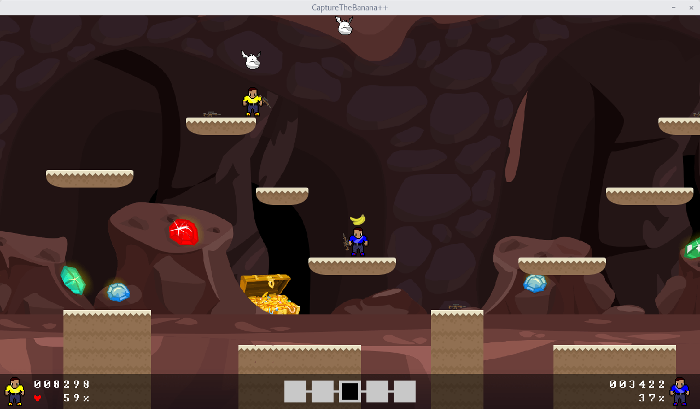

# CaptureTheBanana++

CaptureTheBanana++ is a multiplayer PvP game, focused on fast pace combat to allow to carry a flag to the respective endscreen.



A cute game which can break friendships. Have fun playing! :star2:

## Dependencies

These are the dependencies currently used by CaptureTheBanana++.

- boost 1.57 or above
- Box2D (Linux only)
- SDL2 and SDL2_image
- SDL2 Mixer (optional, for sound)
- Qt v5.9 or above (optional, for editor)

## Documentation

- [Installation](docs/wiki/overview/installation.md)
- [Build instructions](docs/wiki/development/build-instructions.md)
- [Contributing](docs/wiki/development/contributing.md)
- [Wiki](docs/wiki/home.md)

## Usage

```
usage:
  CaptureTheBanana [<path>] options

where options are:
  -?, -h, --help    display usage information
  -d, --debug       enable debug mode
  -s, --no-sound    disable sound
  -v, --version     show version information
  --verbose         show more debug information
```

## License

CaptureTheBanana++ is licensed under the MIT license. See [LICENSE](LICENSE) for more details.
