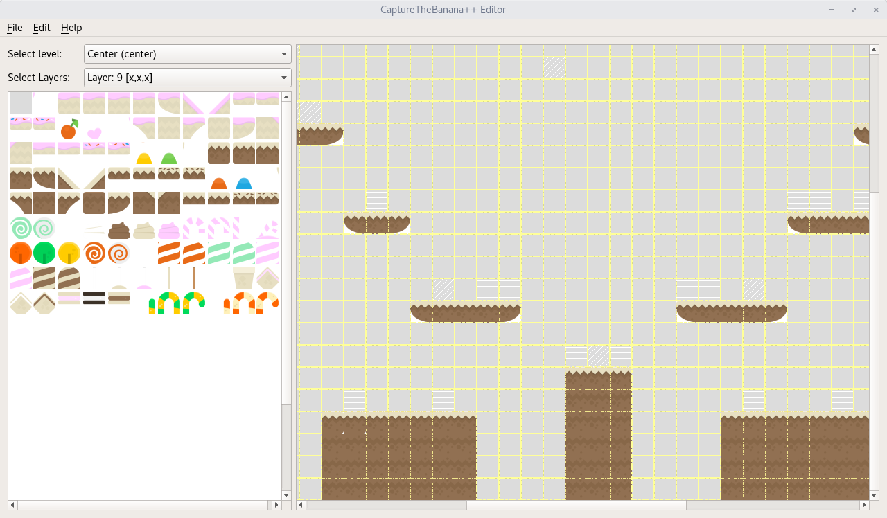
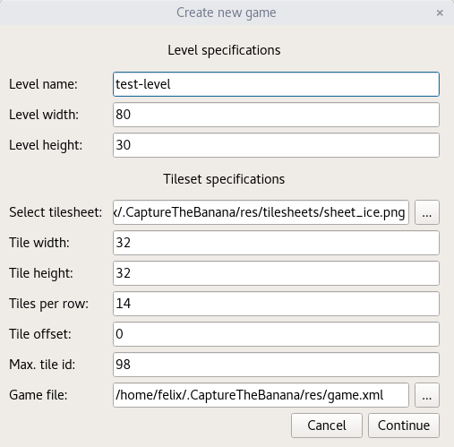
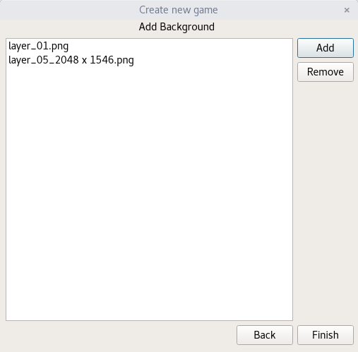
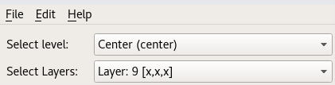
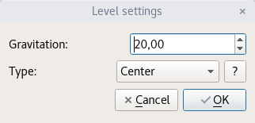
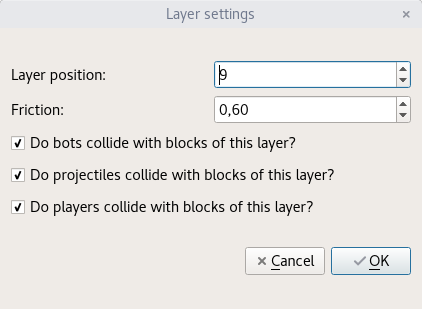
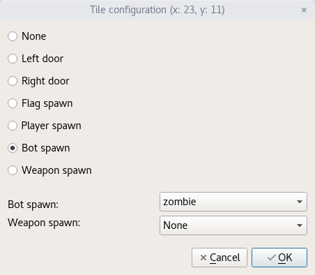

# Editor

Use the menu entries under **File** to create a new game or open an existing game.

### First look

On the left side you have the tile selector, where you can select a tile and then mark the layer panel. The layer panel is on the right side and represents the selected layer - part of the level. A white brush indicates a spawn point. You can also switch levels and layers (see [Switching levels and layers](#switching-levels-and-layers)).

## Create a new game

To create a new game click under **File** on **New**. Fill in all required fields and continue.

Please note: To create a new game we need information, such as bots, fonts, sounds and weapons. These information are saved in a `game.xml` file and you must specify the path to it. If your create a new game we will delete all levels and start from scratch. If you want to keep the old game and level configuration, you have to make a copy of the `game.xml` directory.

**Level specifications:**

- **Level name:** The name of the level
- **Level width:** The width in tiles of the level
- **Level height:** The height in tiles of the level

**Tilesheet specifications:**

- **Select tilesheet:** Path to the tilesheet
- **Tile width:** The tile width in pixels
- **Tile height:** The tile height in pixels
- **Tiles per row:** Tiles per row (starting from 1)
- **Tile offset:** Horizontal and vertical offset in pixels between two tiles
- **Max. tile id:** Maximal tile id (starting from 1)
- **Game file:** Path to the `game.xml`

All resource files must be in the same directory as the `game.xml` or in a subdirectory.

### Background/Parallax

To add a background click on the **Add** button on the right. Choose a image and give it a scroll speed between 0-100%.

If you would like to change the background later, go to `Edit->Level->Edit background settings of current level`.

## Add a new level

To add a level open **Edit**, expand **Level** and click on **New level**. Fill in all required fields, as described above.

## Switching levels and layers

To view another level or layer, simply select a level or layer from the drop-down menu.

Layers allow you to set which layer is displayed from the selected level.

## Level settings

The level settings dialog allows you to change gravitation and the level type.

**Types of levels:**

- **Center:** Level is always in the middle of a game and should be symmetrical.
- **Default:** Levels are in between center and end levels.
- **End:** Levels are at the end of the world.

Note: Each game must have at least one center, default and end level.

## Layer/tileset settings

To edit settings of selected layer go to `Edit -> Layer` and click on **Edit settings of current layer**. You can change the layer position (the lowest layer position gets rendered first, and then the others incrementally) and friction at the top of the dialog. If the friction value is low, the player will slide on blocks. You can also select whether the selected layer collide with bots, projectiles and/or players.

### Tile configuration

The tile configuration dialog allows you to set spawn points.

- **Left door:** Each level needs a left and right door to switch levels.
- **Right door:**  Each level needs a left and right door to switch levels.
- **Flag spawn:** Each level needs a flag/banana spawn point.
- **Player spawn:** Each level should have several different player spawns to (re)spawn players.
- **Bot spawn:** Bot spawn point for the selected bot below (here: zombie).
- **Weapon spawn:** Weapon spawn point for the selected weapon below.

## Layer panel right-click menu

Right-click anywhere in the layer panel.

- **Details:** Opens a tile configuration dialog
- **Set mark:** Sets a marker
- **Remove mark:** Removes selected marker
- **Remove:** Removes selected tile

## Shortcuts

- **Shift + Left Mouse Button:** Removes selected tile
- **Ctrl + Left Mouse Button:** Opens a tile configuration dialog
- **Alt + Left Mouse Button:** Sets spawn point
- **Left Mouse Button Pressed + "Move"**: Marks multiple tiles

