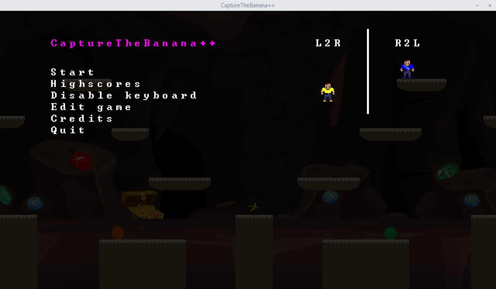

# CaptureTheBanana++

Welcome to the documentation of CaptureTheBanana++! CaptureTheBanana++ is a free and open source multiplayer PvP game, focused on fast pace combat to allow to carry a flag to the respective endscreen.

Available on Linux, macOS and Windows.

## Overview

- [About](overview/about.md)
- [Installation](overview/installation.md)

### Game

- [Game design](game/game-design.md)
- [Controls](game/controls.md)
- [Editor instructions](game/editor.md)

### Development

- [Contributor Covenant Code of Conduct](https://github.com/CaptureTheBanana/CaptureTheBanana/CODE_OF_CONDUCT.md)
- [Contributing](development/contributing.md)
- [Build instructions](development/build-instructions.md)
- [Code documentation (doxygen)](#TODO) [TODO: link doxygen website]
- [File Formats](development/file-formats.md)
